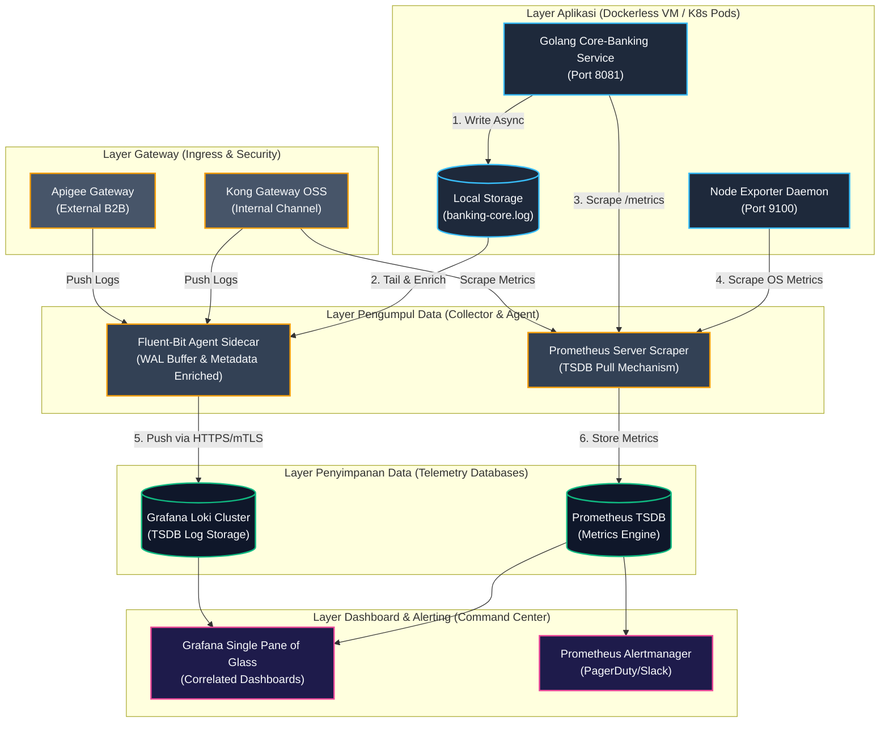

# 🏛️ Blueprint Arsitektur Observability Perbankan (Enterprise & Ideal)

Dokumen ini mendefinisikan standar arsitektur Observability kelas *Tier-1 Enterprise* untuk sistem pembayaran perbankan dengan throughput tinggi dan latensi rendah. Desain ini dirancang untuk memenuhi kepatuhan regulasi keuangan internasional (**PCI-DSS v4.0, ISO 27001, SOC2, OJK, dan Bank Indonesia**).

---

## 🗺️ Diagram Arsitektur Sistem Terintegrasi

Berikut adalah visualisasi aliran data telemetry (Logs, Metrics, Traces) dari tingkat aplikasi hingga visualisasi di Pusat Komando SRE (*SRE Command Center*):

---

## 🏛️ 4 Pilar Observability Ideal untuk Perbankan

Sistem Observability ideal di bank wajib mengadopsi konsep **M.E.L.T.** (Metrics, Events, Logs, Traces) secara terpadu dan saling terhubung:

### 1. Logs (Catatan Kejadian Terstruktur)
* **Karakteristik:** Menyimpan jejak audit *step-by-step* transaksi secara mendalam.
* **Standar Enterprise:**
  * **Masking PII di Hulu:** Masking data sensitif kartu (PAN/CVV) dilakukan di dalam kode aplikasi sebelum menyentuh file log.
  * **Asynchronous Buffer:** Penulisan log tidak boleh memblokir thread transaksi utama (latensi sub-milidetik).
  * **Log Load Shedding:** Jika server mengalami overload trafik, log dengan prioritas rendah (`DEBUG`/`INFO`) otomatis dibuang untuk mengamankan CPU & ruang disk server.

### 2. Metrics (Kesehatan Resource & Bisnis)
* **Karakteristik:** Menyajikan data statistik kesehatan server dan volume transaksi secara *real-time*.
* **Standar Enterprise:**
  * **Metrik Runtime Aplikasi (RAM & Goroutines):** Dipantau langsung lewat port `/metrics` internal bahasa pemrograman.
  * **Metrik OS Host (CPU, RAM Global, Disk):** Ditarik menggunakan agen Node Exporter untuk mendeteksi ancaman kapasitas hardware.
  * **RED Method:** Memantau **R**ate (jumlah request/detik), **E**rrors (jumlah error/detik), dan **D**uration (latensi transaksi P95/P99).

### 3. Log-Based Tracing (Keterlacakan Berbasis Log)
* **Karakteristik:** Melacak satu transaksi dari ujung ke ujung melintasi puluhan *microservices* tanpa *overhead* sistem tracing yang berat.
* **Keputusan Arsitektur (Tanpa OTel):** Sistem ini secara sadar **TIDAK** menggunakan OpenTelemetry (OTel) maupun Jaeger/Tempo demi menghemat konsumsi CPU dan menyederhanakan *stack* operasional.
* **Standar Enterprise:**
  * **Correlation ID Propagation:** Memanfaatkan injeksi header `X-Correlation-ID` murni (tanpa kerumitan OTel SDK) yang diteruskan secara berantai dari Gateway ke seluruh *Service*.
  * **Contextual Log Aggregation:** *Correlation ID* dicetak otomatis ke dalam struktur JSON Log menggunakan Go `slog`. Tim SRE cukup memasukkan ID tersebut ke dalam *query* Grafana Loki untuk merangkai jejak transaksi secara kronologis tanpa sistem tracing terpisah.

### 4. Alerting & Incident Response (Sistem Peringatan Dini)
* **Karakteristik:** Mengirim peringatan otomatis sebelum sistem mengalami downtime.
* **Standar Enterprise:**
  * **Dynamic Threshold Alerting:** Peringatan otomatis jika latensi transaksi P99 naik melebihi **100ms** selama 1 menit, atau ruang disk sisa **< 15%**.
  * **On-Call Integration:** Integrasi ke SMS, Telegram, Slack, atau platform on-call SRE seperti **PagerDuty**.

---

## 🛡️ Sisi Kepatuhan Keamanan Data (Security & Compliance)

Untuk lolos audit internasional, sistem Observability perbankan harus menerapkan aturan berikut:

1. **Separation of Duties (SoD):**
   * Developer aplikasi **TIDAK BOLEH** memiliki akses membaca log produksi secara langsung di OS host server. Mereka hanya boleh melihat log lewat portal dashboard Grafana yang telah disanitasi.
2. **Encryption-at-Rest:**
   * Disk fisik tempat file log disimpan wajib dienkripsi penuh menggunakan AES-256 (LUKS / OS Encrypted Volume) dan kuncinya dikelola oleh KMS (*Key Management System*) seperti **HashiCorp Vault**.
3. **mTLS (Mutual TLS):**
   * Semua data telemetri yang dikirimkan melewati jaringan kabel lokal (*data center network*) wajib menggunakan enkripsi **TLS 1.3** dengan sertifikat SSL timbal balik (mTLS) untuk menghindari penyadapan.
4. **Log Retention & Purging Rule:**
   * Log lokal di server host dihapus setiap **7 hari** (menjaga disk tetap lega), namun log di database pusat (Loki/S3) disimpan minimal **1 tahun** untuk kebutuhan audit kepatuhan keuangan.
