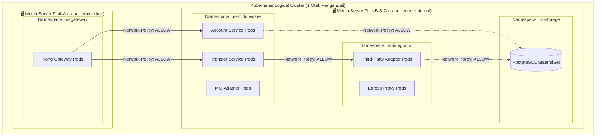

# KUBERNETES DEPLOYMENT & SECURITY STRATEGY
## Arsitektur Orkestrasi Core Banking (Production-Grade)

Dokumen ini memaparkan strategi penyebaran (*deployment*) dan pengamanan tingkat lanjut untuk menjalankan ekosistem *Microservices* kita di atas klaster Kubernetes. Falsafah utama dari arsitektur ini adalah **Zero Trust Network**, **High Availability (HA)**, dan **Isolasi Beban Kerja (Workload Isolation)**.

---

## 🏗️ 1. PEMBAGIAN ZONA (NAMESPACE SEPARATION)

Untuk memisahkan akses administratif dan membatasi "Blast Radius" (dampak jika terjadi peretasan), sistem kita akan dibagi ke dalam beberapa **Namespace** khusus di Kubernetes. Ini persis seperti memisahkan lantai di dalam sebuah gedung rahasia.



---

## 🔒 2. ZERO TRUST NETWORK (NETWORK POLICIES)

Meskipun Pod berada di dalam K8s yang sama, mereka dilarang keras saling berkomunikasi secara bebas. Kita menggunakan **Kubernetes NetworkPolicy** (misal via *Calico* atau *Cilium*) sebagai tembok api internal.

### Aturan Ketat (Whitelist Only):
1. **Gateway ke Middleware:** `ns-gateway` HANYA diizinkan memanggil port `8080` milik *Transfer Service* dan *Account Service*.
2. **Transfer ke Account:** *Transfer Service* HANYA diizinkan memanggil port `50051` (gRPC) milik *Account Service*.
3. **Pengekangan Adapter (The Quarantine):** *Third-Party Adapter* **SAMA SEKALI TIDAK DIIZINKAN** memulai panggilan (Egress) ke *Account Service* atau *Transfer Service*. Mereka hanya boleh memanggil *Egress Proxy* dan *PostgreSQL*.
4. **Proteksi Database:** *PostgreSQL* HANYA menerima koneksi masuk (Ingress) pada port `5432` dari `ns-middleware` dan `ns-integration`. Upaya akses dari Pod lain (misal dari Pod aplikasi promosi) akan di-*drop* (buang) secara otomatis pada level kernel jaringan (eBPF/iptables).

---

## ⚖️ 3. TATA LETAK FISIK & HIGH AVAILABILITY (POD ANTI-AFFINITY)

Untuk menjamin layanan bank tidak pernah mati (99.99% Uptime), kita menggunakan **Pod Anti-Affinity**. 
Jika kita memiliki 3 buah *Server Worker Node* (Mesin VM fisik/Cloud), Kubernetes dilarang menaruh semua Replika *Transfer Service* di 1 mesin yang sama.

* **Skenario Bencana:** Jika "Mesin Node A" terbakar di Data Center, Pod *Transfer Service* yang berada di "Mesin Node B" dan "Mesin Node C" akan langsung mengambil alih lalu lintas transaksi tanpa ada nasabah yang menyadari terjadinya pemadaman.

```yaml
# Contoh Cuplikan Konfigurasi Anti-Affinity di Deployment K8s
affinity:
  podAntiAffinity:
    requiredDuringSchedulingIgnoredDuringExecution:
    - labelSelector:
        matchExpressions:
        - key: app
          operator: In
          values:
          - transfer-service
      topologyKey: "kubernetes.io/hostname"
```

---

## 🚀 4. RESOURCE LIMITS & AUTO-SCALING (HPA)

Sesuai dengan alokasi *Enterprise* yang telah disepakati, setiap *Microservice* wajib dideklarasikan batas konsumsinya (*Requests* & *Limits*) di K8s agar tidak terjadi "Tetangga Berisik" (*Noisy Neighbor*).

Jika terjadi lonjakan transaksi massal (misalnya: Hari Gajian / *Flash Sale*), kita mengandalkan **Horizontal Pod Autoscaler (HPA)**.

* **Trigger Skalabilitas:** Jika rata-rata penggunaan CPU *Transfer Service* menembus **80%**, HPA akan otomatis memerintahkan Kubernetes untuk menetaskan (*spawn*) Pod baru (hingga batas maksimal 10 Pod).
* **Cooling Down:** Ketika trafik kembali sepi (jam 3 pagi), HPA akan membunuh Pod-Pod ekstra tersebut, menyisakan batas minimal (misal 2 Pod), sehingga menghemat biaya *Cloud*.

---

## 🔐 5. MANAJEMEN RAHASIA (SECRETS & CONFIGMAPS)

Tidak boleh ada *password* atau *credential* yang di-*-hardcode* di dalam kode sumber Golang (Repository Git).

1. **ConfigMap (Untuk Konfigurasi Tidak Rahasia):**
   File `application.yaml` (berisi URL internal, *timeout*, *log level*) disimpan dalam *ConfigMap*. *ConfigMap* ini akan di-*mount* sebagai *Volume* ke dalam Pod Golang. Karena kita menggunakan pustaka `Viper WatchConfig()`, setiap kali kita mengubah nilai di *ConfigMap*, Pod Golang akan langsung merespons dan mengganti konfigurasinya tanpa perlu *restart* (Zero Downtime).
   
2. **Secrets (Untuk Password & Sertifikat mTLS):**
   *Password* PostgreSQL dan sertifikat mTLS milik *Egress Proxy* disimpan di **Kubernetes Secrets**. K8s akan menyuntikkannya langsung ke dalam memori (RAM) kontainer (via *tmpfs*), sehingga data sensitif ini tidak pernah tertulis di *Harddisk/SSD* mesin fisik untuk menghindari pencurian forensik.
