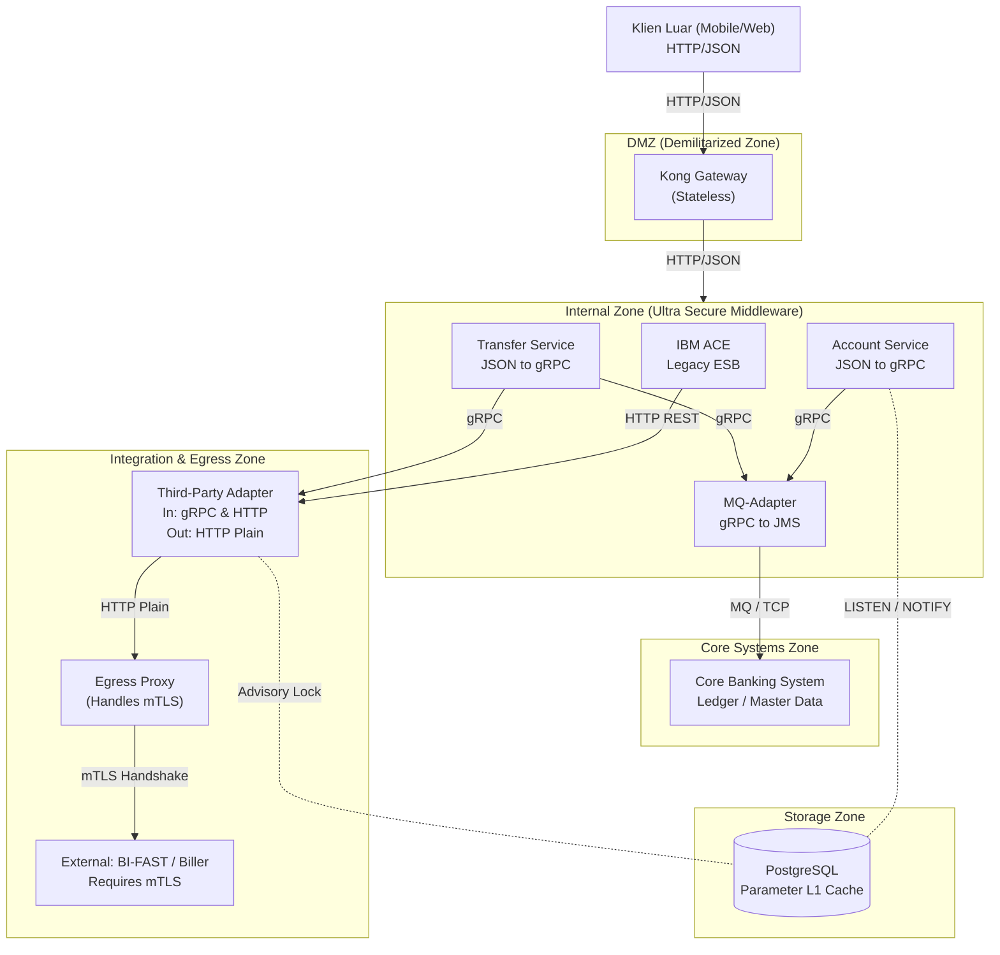

# PANDUAN TEKNIS ARSITEKTUR MIKROSERVIS CORE BANKING PoC
## IMPLEMENTASI DEKOPEL LAYANAN, TRANS-AKSI SAGA, & DISTRIBUTED LOG CORRELATION

Dokumen ini menyajikan panduan mendalam tentang arsitektur mikroservis terdistribusi yang dikembangkan untuk Proof of Concept (PoC) platform Core Banking. Sistem ini berfokus pada pemisahan basis data (*Database-per-Service*), integrasi berbasis gRPC berkinerja tinggi, dan propagasi Correlation ID untuk keterlacakan log satu pintu.

---

## 🛠️ 1. RINGKASAN ARSITEKTUR SISTEM (PRODUCTION TARGET DESIGN)

Sistem produksi didekopel secara bertingkat untuk mengamankan Core Banking, mengisolasi kompilasi CGO, dan menjamin efisiensi memori:



### 1.1 Spesifikasi Komponen

| Layanan | Bahasa / Run-time | Resource (CPU/RAM) | Protokol Eksternal | Protokol Internal | Tugas & Tanggung Jawab | Database / Storage |
| :--- | :--- | :--- | :--- | :--- | :--- | :--- |
| **API Gateway (Kong)** | Kong OSS (DB-less) | 2 Cores / 2 GB | HTTP REST (Port `8080`) | HTTP REST | Border gateway, validasi HMAC payload signature, meneruskan JSON ke Middleware. | *None (Stateless)* |
| **Transfer Service (Middleware)** | Go (CGO-Free) | 1 Core / 1 GB | HTTP REST (Port `8080`) | gRPC Client | Penerjemah JSON ke gRPC, validasi parameter bisnis, *Error Mapping*, *L1 In-Memory Cache*. | `parameter_db` (Postgres) |
| **Account Service** | Go / Legacy | 1 Core / 512 MB | - | gRPC Server | Eksekutor transaksi finansial utama, orkestrasi mutasi, pengelola ledger utama. | Core DB |
| **MQ Adapter Java** | Java 21 (Plain JRE) | 2 Cores / 4 GB | - | gRPC Server | Adapter khusus IBM MQ (Jakarta JMS murni). | IBM MQ |
| **Third-Party Adapter** | Go (CGO-Free) | 0.5 Core / 256 MB | HTTP REST (Port `8080`) | gRPC & HTTP | *Auth Proxy* Pusat, injeksi token vendor, validasi *Webhook*, *rate-limit* eksternal. | `adapter_db` (Postgres) |

---

## 🔗 2. DISTRIBUTED LOG CORRELATION (PROPAGASI TRACE ID)

Untuk melacak aliran eksekusi request yang melewati beberapa mikroservis tanpa OpenTelemetry (OTel), sistem memanfaatkan propagasi **Correlation ID** terdistribusi yang direkam dalam log terstruktur JSON.

### 2.1 Aliran Header & Metadata
1. **Pintu Masuk (HTTP Header):** API Gateway menerima request HTTP. Middleware mengekstrak header `X-Correlation-ID` dan `X-Channel-ID`. Jika kosong, ID korelasi dibuat otomatis (`txn-gw-<timestamp>-<rand>`).
2. **Context Lokal Go:** ID disimpan di dalam local context Go menggunakan kunci string untyped (`X-Correlation-ID`) agar logger lokal dapat mencetaknya secara otomatis ke log JSON.
3. **Pintu Internal (gRPC Metadata):** Sebelum melakukan call gRPC ke Transfer/Account Service, klien menyisipkan Correlation ID ke gRPC metadata context (`x-correlation-id`).
4. **Penerimaan Downstream:** Penerima gRPC interceptor membaca metadata masuk, menyuntikkannya ke context lokal, dan meneruskannya ke logger lokal downstream.

```
[Klien HTTP] -> (HTTP Header: X-Correlation-ID) -> [API Gateway]
                                                           |
                                                (gRPC Metadata Context)
                                                           v
[Account Service] <- (gRPC Metadata Context) <- [Transfer Service]
```

### 2.2 Kode Komponen Propagasi

#### A. gRPC Client Metadata Injection (Sisi Pengirim)
Fungsi pembantu di Transfer Service menyuntikkan ID korelasi ke context outgoing sebelum memanggil gRPC Account Service:
```go
// Ambil ID dari context lokal
correlationID, _ := ctx.Value(logger.CorrelationIDKey).(string)
channelID, _ := ctx.Value(logger.ChannelIDKey).(string)

// Bungkus ke dalam metadata pasangan key-value gRPC
md := metadata.Pairs("x-correlation-id", correlationID, "x-channel-id", channelID)
outCtx := metadata.NewOutgoingContext(ctx, md)

// Eksekusi call gRPC dengan context metadata baru
res, err := s.acctClient.Debit(outCtx, &pb.DebitRequest{...})
```

#### B. gRPC Unary Server Interceptor (Sisi Penerima)
Didaftarkan pada gRPC Server di Account Service dan Transfer Service untuk menangkap metadata yang masuk secara otomatis:
```go
func correlationInterceptor(ctx context.Context, req interface{}, info *grpc.UnaryServerInfo, handler grpc.UnaryHandler) (interface{}, error) {
	md, ok := metadata.FromIncomingContext(ctx)
	var correlationID string
	var channelID string
	if ok {
		if ids := md.Get("x-correlation-id"); len(ids) > 0 {
			correlationID = ids[0]
		}
		if ids := md.Get("x-channel-id"); len(ids) > 0 {
			channelID = ids[0]
		}
	}
	// Injeksi ke context menggunakan key yang dimengerti oleh logger
	if correlationID != "" {
		ctx = context.WithValue(ctx, logger.CorrelationIDKey, correlationID)
	}
	if channelID != "" {
		ctx = context.WithValue(ctx, logger.ChannelIDKey, channelID)
	}
	return handler(ctx, req)
}
```

---

## 🛡️ 3. SAGA COMPENSATING TRANSACTION (DELEGASI KE CORE)

Sebagai sebuah **Middleware Translator (Service Mid)**, layanan ini bersifat *Stateless* terhadap transaksi finansial murni. Middleware **HARAM** melakukan *Rollback* atau eksekusi *Saga Pattern* secara mandiri.

Semua tugas kompensasi transaksi, *rollback* saldo, dan orkestrasi Saga secara mutlak didelegasikan (di-*bypass*) ke sistem **Core (Core Banking System aslinya)**. 

Tugas utama Middleware pada fase ini hanyalah:
1. Meneruskan (*Bypass/Forward*) *request* transaksi ke sistem Core.
2. Menangkap *error* spesifik dari Core (misalnya `ERR-509`).
3. Menerjemahkannya menjadi format HTTP REST yang ramah klien menggunakan sistem *Error Mapping*.

---

## ⚡ 4. MANAJEMEN PARAMETER & CACHING SUPER CEPAT

Untuk menunjang proses terjemahan (seperti *Error Mapping*, *Fee*, dan penentuan Rute) dalam hitungan milidetik, Middleware menggunakan **Arsitektur Caching Berbasis Event (PostgreSQL + L1 Go Memory)**.

### 4.1. Pemisahan Konfigurasi
* **Konfigurasi Teknis / Aplikasi (Timeout, Maintenance):** Menggunakan **YAML File Watcher (Viper + fsnotify)**. File `application.yaml` di-*mount* ke dalam kontainer dan dibaca seketika ke dalam RAM saat ada perubahan di Host OS (Zero Downtime).
* **Konfigurasi Bisnis (Error Mapping, Fee, GL):** Disimpan di **PostgreSQL** dan disalin ke **Go Local In-Memory Cache**.

### 4.2. Arsitektur Sinkronisasi Real-Time (LISTEN / NOTIFY)
Alih-alih menggunakan Redis yang menambah beban infrastruktur, Middleware memanfaatkan fitur bawaan `LISTEN / NOTIFY` dari PostgreSQL:
1. Tabel dipecah berdasarkan struktur ketat (*Strictly Typed*): `error_mappings`, `fees`, `gl_mappings`.
2. Setiap tabel memiliki kolom `feature_name` untuk kemudahan pemfilteran.
3. *Database Trigger* memancarkan sinyal `NOTIFY` dengan membawa nama fitur setiap kali tim Ops mengubah data.
4. *Transfer Service (Middleware)* menggunakan koneksi TCP eksklusif (Jalur VIP) untuk menangkap sinyal tersebut dan langsung memperbarui RAM internalnya (L1 Cache).

Kecepatan pencarian parameter menggunakan arsitektur ini mencapai **~10 nanodetik**, menjadikannya standar tertinggi untuk *Enterprise High-Frequency Transaction*.

### 3.1 Implementasi Kode Saga Kompensasi di Go
```go
// Step 1: Debit akun asal
debitRes, err := s.acctClient.Debit(outCtx, &pb.DebitRequest{
	AccountNumber: req.GetSourceAccount(),
	Amount:        req.GetAmount(),
	TransactionId: txnID,
})
if err != nil || !debitRes.GetSuccess() {
	s.recordTransfer(ctx, txnID, req, "DECLINED")
	return &pb.TransferResponse{Success: false, Message: "debit declined"}, nil
}

// Step 2: Credit akun tujuan
creditRes, err := s.acctClient.Credit(outCtx, &pb.CreditRequest{
	AccountNumber: req.GetTargetAccount(),
	Amount:        req.GetAmount(),
	TransactionId: txnID,
})
if err != nil || !creditRes.GetSuccess() {
	// Pemicu Saga Kompensasi: Kembalikan uang yang terlanjur didebit
	refundRes, refundErr := s.acctClient.Credit(outCtx, &pb.CreditRequest{
		AccountNumber: req.GetSourceAccount(),
		Amount:        req.GetAmount(),
		TransactionId: txnID + "-refund",
	})
	if refundErr != nil || !refundRes.GetSuccess() {
		s.recordTransfer(ctx, txnID, req, "CRITICAL_REVERSAL_FAILED")
	} else {
		s.recordTransfer(ctx, txnID, req, "REVERSED")
	}
	return &pb.TransferResponse{Success: false, Message: "transfer failed, reversed"}, nil
}

// Step 3: Catat Sukses
s.recordTransfer(ctx, txnID, req, "SUCCESS")
```

---

## 🛡️ 5. CUSTOM LOGGER LIBRARY & RECTIFICATION (pkg/logger)

Logger internal kita menggunakan Go structured logging (`slog`) yang terintegrasi dengan **Zero-Locking Asynchronous Ring Buffer** dan proteksi stabilitas **Load Shedding** untuk performa TPS tinggi.

### 5.1 Perbaikan Struktur Handlers (WithAttrs Bug Fix)
Dalam pustaka `log/slog` bawaan Go, method `slog.Logger.With(args...)` akan memanggil method `WithAttrs` dari handler yang terpasang. Jika custom handler (seperti `BankingLogHandler`) tidak mengimplementasikan `WithAttrs` secara eksplisit, Go secara otomatis melepas custom handler luar dan kembali menggunakan handler bawaan (`jsonHandler`), sehingga fungsi injeksi Correlation ID menjadi tidak aktif.

Untuk mengatasinya, kami merancang rectificator method di **[`pkg/logger/logger.go`](file:///Users/hasan/Projects/banking-microservices/pkg/logger/logger.go)**:
```go
// BankingLogHandler membungkus standard handler
type BankingLogHandler struct {
	slog.Handler
}

// Dengan mengimplementasikan method ini, BankingLogHandler tetap bertahan di logger runtime
func (h *BankingLogHandler) WithAttrs(attrs []slog.Attr) slog.Handler {
	return &BankingLogHandler{Handler: h.Handler.WithAttrs(attrs)}
}

func (h *BankingLogHandler) WithGroup(name string) slog.Handler {
	return &BankingLogHandler{Handler: h.Handler.WithGroup(name)}
}
```

---

## 📖 6. BUKU PANDUAN PENGUJIAN DAN VERIFIKASI (Runbook)

### 5.1 Menyalakan Instansi PoC
Jalankan perintah ini di dalam host mesin Virtual Machine atau terminal lokal:
```bash
cd /Users/hasan/Projects/banking-microservices/deploy
podman-compose down && podman-compose up -d --build
```
*Pastikan seluruh 9 kontainer (API Gateway, Transfer, Account, 2 Database Postgres, Loki, Prometheus, Fluent-bit, Grafana) berstatus `Up`.*

### 5.2 Simulasi Payload E2E
Kirim request transfer dana ke API Gateway REST port 8080:
```bash
curl -i -X POST http://localhost:8080/api/v1/transfer \
  -H "Content-Type: application/json" \
  -H "X-Channel-ID: MOBILE_APP" \
  -d '{"source_account":"110-000-1","target_account":"110-000-2","amount":1000000,"currency":"IDR"}'
```
*Ambil ID korelasi yang dikembalikan oleh server di dalam response header `X-Correlation-ID`.*

### 5.3 Pembuktian Trace Log
Buka Grafana Loki Dashboard (atau akses loki CLI) dan jalankan kueri LogQL untuk menemukan trace logs transaksi terdistribusi secara runut:
```logql
{job="banking-core"} |= "txn-gw-xxxxxx-xxxx"
```
Anda akan melihat trace log di bawah ini bersatu di bawah satu ID pelacak, membuktikan keselarasan korelasi log microservices sukses:
1. `api-gateway` -> *Handling REST Transfer request*
2. `transfer-service` -> *Starting fund transfer process*
3. `transfer-service` -> *Initiating debit on source account*
4. `account-service` -> *Debit request received*
5. `account-service` -> *Debit transaction successful*
6. `transfer-service` -> *Initiating credit on target account*
7. `account-service` -> *Credit request received*
8. `account-service` -> *Credit transaction successful*
9. `transfer-service` -> *Fund transfer completed successfully*
10. `api-gateway` -> *REST Transfer call completed*

---

## ☕ 6. ALTERNATIF PRODUCTION-READY ADAPTER (JAVA 21)

Sebagai pilihan "Best Deal" jangka panjang yang terhindar dari ketergantungan CGO (IBM MQ C SDK), kami telah membuat modul alternatif **[`mq-adapter-java`](file:///Users/hasan/Projects/mq-adapter-java)** menggunakan **Plain Java 21 + gRPC + Jakarta JMS**.

### 6.1 Spesifikasi Arsitektur Java Adapter

```
[Middleware Go]
       │
       │ (gRPC port 8084)
       v
[MQ-Adapter-Java] ──> Spawn Virtual Thread (Loom) per request
       │
       ├──> 1. Register HDRTRN ke ConcurrentHashMap + CompletableFuture
       ├──> 2. Kirim pesan ke REQ.QUEUE (JMS Connection Pool)
       └──> 3. Block future.get() menunggu balasan (Yield Carrier Thread)
```

Konsumen Asinkron Latar Belakang (`MQConsumerPool`):
```
[RES.QUEUE] ──> Dibaca oleh Consumer Worker (Virtual Threads)
       │
       ├──> 1. Extract HDRTRN dari raw bytes [0:25]
       └──> 2. Panggil future.complete() ──> Bangunkan gRPC waiter
```

### 6.2 File Komponen yang Dibuat

1. **[`pom.xml`](file:///Users/hasan/Projects/mq-adapter-java/pom.xml):** Konfigurasi Maven dengan target Java 21, dependency Jakarta JMS `com.ibm.mq.jakarta.client`, io.grpc-java, dan plugin otomatisasi protobuf compiler.
2. **[`gateway.proto`](file:///Users/hasan/Projects/mq-adapter-java/src/main/proto/gateway.proto):** Kontrak protobuf yang mendefinisikan interface `MQGateway` beserta payload `MQRequest` dan `MQResponse`.
3. **[`MQConnectionPool.java`](file:///Users/hasan/Projects/mq-adapter-java/src/main/java/com/mdw/gateway/server/MQConnectionPool.java):** Manager koneksi IBM MQ Jakarta JMS murni (Type 4 Driver) yang mengelola koneksi TCP persisten.
4. **[`MQConsumerPool.java`](file:///Users/hasan/Projects/mq-adapter-java/src/main/java/com/mdw/gateway/server/MQConsumerPool.java):** Consumer daemon asinkron yang memanfaatkan **Java 21 Virtual Threads** (`Executors.newVirtualThreadPerTaskExecutor()`) untuk mendengarkan antrean balasan MQ secara non-blocking.
5. **[`MQGatewayServiceImpl.java`](file:///Users/hasan/Projects/mq-adapter-java/src/main/java/com/mdw/gateway/server/MQGatewayServiceImpl.java):** Implementasi gRPC server yang mengawinkan request masuk ke `CompletableFuture` sinkron-asinkron berdasarkan key `HDRTRN`.
6. **[`MQGatewayServer.java`](file:///Users/hasan/Projects/mq-adapter-java/src/main/java/com/mdw/gateway/server/MQGatewayServer.java):** Entry point launcher server gRPC port 8084 yang dilengkapi shutdown hook untuk penanganan graceful shutdown.
7. **[`Dockerfile`](file:///Users/hasan/Projects/mq-adapter-java/Dockerfile):** Multi-stage build menggunakan Debian-based Maven image (untuk kelancaran download protoc compiler ber-glibc) dan runtime image minimalis Eclipse Temurin JRE Alpine yang berjalan aman di bawah non-root user (PCI-DSS compliant).

### 6.3 Cara Build Docker Image Java Adapter
Jalankan perintah berikut untuk mengompilasi dan mengemas Java Adapter secara otomatis ke dalam container image yang teroptimasi RAM (G1GC & StringDeduplication diaktifkan):
```bash
cd /Users/hasan/Projects/mq-adapter-java
podman build -t mq-adapter-java:latest .
```
Image `mq-adapter-java:latest` siap digunakan sebagai pengganti `mq-gateway` Go di production dengan kestabilan penuh driver Java resmi dan tanpa biaya perawatan CGO compiler di CI/CD.

---

## ⚡ 7. ESTIMASI RESOURCE & EFISIENSI SISTEM

Desain hibrida ini dirancang khusus untuk meminimalkan konsumsi resource server secara ekstrim dengan memisahkan beban CPU bisnis dan beban I/O legacy.

### 7.1 Profil Konsumsi Resource Per Layanan (Single Instance)

| Komponen | Bahasa / runtime | Penggunaan RAM (Idle) | Penggunaan RAM (Peak Load) | Penggunaan CPU (Beban Puncak) | Karakteristik Performa |
| :--- | :--- | :--- | :--- | :--- | :--- |
| **API Gateway (Kong)** | Kong OSS (DB-less) | **~150 MB** | **~250 MB** | ~ 0.2 Core / 2.000 TPS | Nginx event-driven, Lua verification overhead. |
| **Transfer Service** | Go (CGO-Free) | **~15 MB** | **~35 MB** | ~ 0.2 Core / 1.000 TPS | Mengelola pool koneksi DB lokal dan state Saga. |
| **Account Service** | Go (CGO-Free) | **~15 MB** | **~35 MB** | ~ 0.2 Core / 1.000 TPS | Mutasi saldo berkinerja tinggi secara ACID. |
| **MQ Adapter Java** | Java 21 (JRE Alpine) | **~40 MB** | **~90 MB** | ~ 0.5 Core / 2.000 TPS | Bebas biaya stack switching CGO. Efisiensi socket TCP JIT tingkat tinggi. |
| **TOTAL STACK** | **Hybrid Go-Java** | **~220 MB** | **~410 MB** | **~1.1 Core / Peak** | Seluruh kontainer sangat ringan dan hemat infrastruktur. |

### 7.2 Rekomendasi Alokasi Resource Pod Kubernetes (Sizing limits)

Di bawah ini adalah rekomendasi konfigurasi batas atas dan batas bawah alokasi kontainer pada kluster Kubernetes produksi:

```yaml
# 1. Kong API Gateway Pod
resources:
  requests: { cpu: "250m", memory: "128Mi" }
  limits:   { cpu: "1000m", memory: "256Mi" }

# 2. Transfer Service Pod
resources:
  requests: { cpu: "100m", memory: "64Mi" }
  limits:   { cpu: "1000m", memory: "128Mi" }

# 3. Account Service Pod
resources:
  requests: { cpu: "100m", memory: "64Mi" }
  limits:   { cpu: "1000m", memory: "128Mi" }

# 4. MQ Adapter Java (Singleton Pod - Recreate Strategy)
resources:
  requests: { cpu: "250m", memory: "128Mi" }
  limits:   { cpu: "2000m", memory: "256Mi" }
```

---

## 🛡️ 8. KEAMANAN API GATEWAY (KONG OSS)

Sistem mengadopsi pola **Defense-in-Depth** dengan memisahkan tanggung jawab validasi kredensial (autentikasi/otorisasi) ke lapisan terluar (API Gateway), sehingga Microservices Go internal kita beroperasi dalam lingkungan steril (100% fokus pada *business logic*). 

API Gateway yang digunakan adalah **Kong Gateway OSS** dengan mode operasional **DB-less** (tanpa database). Semua pengaturan dikelola menggunakan file konfigurasi statis (`kong.yml`) yang memungkinkan Zero Downtime Hot-Reloading dan menjamin waktu eksekusi super cepat.

### 8.1 Mekanisme Proteksi Rute (Route Protection)

Gateway membagi tingkat pengamanan rute berdasarkan tingkat risiko transaksi:

1. **Rute Risiko Rendah (Read-Only)**
   - **Endpoint:** `GET /api/v1/accounts/:id/balance`
   - **Plugin Keamanan:** `key-auth` (API Key)
   - **Alur Kerja:** Klien menyematkan header `apikey`. Kong melakukan verifikasi string statis dalam waktu instan (<1ms). Tidak ada *overhead* komputasi hashing yang membebani Gateway.

2. **Rute Risiko Tinggi (Mutasi Finansial / Write)**
   - **Endpoint:** `POST /api/v1/transfer`
   - **Plugin Keamanan:** `hmac-auth`
   - **Alur Kerja:** 
     - Mencegah bahaya **Replay Attack** dan **Man-in-the-Middle Attack (Data Tampering)**.
     - Kong memvalidasi *timestamp* header (`clock_skew` toleransi 5 menit) untuk membuang paket kedaluwarsa.
     - Kong mengkalkulasi ulang Hash SHA256 dari keseluruhan body *payload* request (`validate_request_body: true`) dan mencocokannya dengan header `X-Signature`.
     - Request otomatis dibuang/diblokir di level Gateway jika isi transfer diubah oleh *hacker* di tengah jalan, mengamankan Go Middleware kita dari paparan langsung ancaman dari internet luar.

### 8.2 Topologi Standar Enterprise (5-Tier ESB/SOA Architecture)

Dalam arsitektur *enterprise banking* sejati, topologi didesain menggunakan pola berlapis (5-Tier) yang secara ketat memisahkan tanggung jawab antara lapisan keamanan (Gateway), orkestrasi (BFF), penerjemahan (Middleware/Adapter), dan sistem buku besar (Core). Arsitektur ini menjamin perlindungan mutlak (*Anti-Corruption Layer*) terhadap *Core Banking*:

```mermaid
graph LR
    classDef client fill:#1E293B,stroke:#38BDF8,stroke-width:2px,color:#F8FAFC;
    classDef proxy fill:#475569,stroke:#F59E0B,stroke-width:2px,color:#F8FAFC;
    classDef mid fill:#334155,stroke:#EC4899,stroke-width:2px,color:#F8FAFC;
    classDef adapter fill:#0F172A,stroke:#10B981,stroke-width:2px,color:#F8FAFC;
    classDef core fill:#000000,stroke:#EF4444,stroke-width:2px,color:#F8FAFC;
    classDef obs fill:#4C1D95,stroke:#C084FC,stroke-width:2px,color:#F8FAFC;
    
    %% External Flow
    ExtClient["External Client<br>(B2B / Partner)"]:::client
    Apigee["Google Apigee<br>(External Gateway)"]:::proxy
    Middleware["Middleware<br>(SNAP BI Translator)"]:::mid
    
    %% Internal Flow
    BFF["Channel<br>(BFF / Mobile)"]:::client
    Kong["Kong Gateway OSS<br>(Internal Gateway)"]:::proxy
    
    %% Common Middle
    ServiceMid["Service Mid<br>(Orchestration & Business Logic)"]:::mid
    
    %% Core Boundary
    AdapterCore["Adapter Core<br>(Anti-Corruption Layer)"]:::adapter
    Core["Core Banking<br>(Legacy / System of Record)"]:::core
    
    %% Observability Stack
    subgraph Observability ["Enterprise Observability"]
        FluentBit["Fluent-bit<br>(Log Collector)"]:::obs
        Prometheus["Prometheus<br>(Metrics)"]:::obs
        Loki["Loki<br>(Log Storage)"]:::obs
        Grafana["Grafana<br>(Dashboard)"]:::obs
    end
    
    %% Connections External
    ExtClient -->|Open API / SNAP| Apigee
    Apigee --> Middleware
    Middleware --> ServiceMid
    
    %% Connections Internal
    BFF -->|REST / GraphQL| Kong
    Kong --> ServiceMid
    
    %% Connections Core
    ServiceMid -->|Standard gRPC| AdapterCore
    AdapterCore -->|Proprietary (ISO8583/TCP/XML)| Core
    
    %% Connections Observability
    Kong -.->|Metrics| Prometheus
    Apigee -.->|Logs & Traces| FluentBit
    Kong -.->|Logs & Traces| FluentBit
    Middleware -.->|Logs & Traces| FluentBit
    ServiceMid -.->|Logs, Traces, Metrics| FluentBit
    ServiceMid -.->|Metrics| Prometheus
    
    FluentBit -.-> Loki
    Prometheus -.-> Grafana
    Loki -.-> Grafana
```

#### Penjelasan Komponen:
1. **Channel / BFF:** Bertindak sebagai *Backend-for-Frontend* yang mengurus agregasi UI/UX khusus untuk *channel* internal (seperti Mobile App).
2. **Gateways (Kong & Apigee):** Murni bertindak sebagai satpam keamanan (*Security Boundary*). Kong mengamankan titik masuk internal (autentikasi HMAC/Key), sementara Apigee mengamankan trafik pihak ketiga dengan standar SNAP BI (Asymmetric Crypto).
3. **Middleware (Penerjemah Eksternal):** Menjembatani standarisasi JSON/format spesifik dari pihak ketiga (misal: SNAP BI) agar sesuai dengan struktur data *internal* yang diharapkan oleh *Service Mid*.
4. **Service Mid:** Otak logika bisnis dan orkestrasi perbankan modern (contoh: *Transfer Service*, *Account Service*). Bebas dari urusan keamanan gerbang dan tidak terikat pada format *Core* lama.
5. **Adapter Core:** *Anti-Corruption Layer*. Komponen paling krusial yang menerjemahkan bahasa komunikasi modern (gRPC/REST) dari *Service Mid* menjadi protokol usang/proprietary yang dimengerti oleh sistem *Core* (seperti ISO8583, TCP Socket, atau XML).
6. **Core:** Sistem *buku besar* utama bank yang bersifat kaku dan sangat dilindungi.

### 8.3 Keamanan Konektivitas Eksternal (Defense-in-Depth)

Integrasi eksternal antara Gateway eksternal (seperti Google Apigee) dengan lapisan internal (*Middleware / Service Mid*) tidak boleh hanya mengandalkan satu lapis keamanan (seperti *IP Whitelisting*). Demi memenuhi standar perbankan yang ketat, konektivitas dilindungi oleh konsep **Defense-in-Depth**:

1. **Transport Layer Security (mTLS):**
   Koneksi dari Apigee ke *Ingress* internal bank diwajibkan menggunakan mTLS (*Mutual TLS*). Selain trafik dienkripsi, server internal juga akan secara kriptografis memvalidasi *Client Certificate* milik Apigee, mencegah serangan *IP Spoofing*.
2. **Private Network Topology (VPN/Interconnect):**
   Trafik dari Apigee tidak pernah menyentuh internet publik. Apigee menggunakan jalur pribadi (*Google Cloud Interconnect* atau *Site-to-Site IPSec VPN*) untuk berkomunikasi langsung dengan IP Private internal di Data Center bank.
3. **Pemisahan Tanggung Jawab (DevSecOps vs Developer):**
   - Beban keamanan kriptografis (mTLS, terminasi SSL, validasi IP) dieksekusi 100% oleh **Infrastruktur / Ingress Controller** (wilayah tim DevSecOps).
   - **Tim Developer** yang mengurus kode *Middleware/Service Mid* dibebaskan dari beban tersebut. Mereka cukup mendengarkan *request* HTTP/gRPC biasa.
4. **Network-Level Isolation untuk Sistem Legacy:**
   Jika sistem *Service Mid* bersifat *legacy* dan tidak mampu mengecek validasi *header* (seperti `X-Forwarded-Client`), keamanannya murni digaransi melalui **Topologi Jaringan**. Selama *VPC / Firewall / ACL* menjamin bahwa satu-satunya gerbang masuk ke IP aplikasi *legacy* tersebut hanyalah dari *Ingress* yang telah tervalidasi mTLS-nya, maka sistem *legacy* dipastikan aman berkat *Implicit Trust via Network Boundary*.

---

## 👁️ 9. INTEGRASI DENGAN ENTERPRISE OBSERVABILITY PLATFORM

Arsitektur 5-Tier ini tidak akan bisa diandalkan secara operasional jika kita "buta" terhadap apa yang terjadi di setiap lompatannya. Oleh karena itu, arsitektur topologi jaringan di atas terintegrasi erat dengan perkakas Observabilitas sentral bank (Loki, Prometheus, Grafana). 

### 9.1 Propagasi Keterlacakan (Distributed Tracing) Melintas 5 Lapisan
Karena satu transaksi akan melompat dari *BFF -> Kong -> Service Mid -> Adapter -> Core*, kita membutuhkan benang merah yang mengikat mereka semua:
1. **Titik Awal Keterlacakan (Gateway/BFF):** Setiap *request* yang menyentuh Apigee atau Kong wajib diinjeksi dengan header `X-Correlation-ID` dan `X-Channel-ID`.
2. **Propagasi Otomatis (Middleware/Service Mid):** Begitu *request* masuk ke layanan internal kita (berbasis HTTP atau gRPC), komponen *interceptor* di Go secara otomatis memindahkan *Correlation ID* tersebut ke dalam *Context Logging* (seperti yang telah kita bangun menggunakan library `slog` kustom kita).
3. **Perekaman Sentral (Fluent-bit ke Loki):** Log dari seluruh 5 tier ini dikirim oleh Fluent-bit menuju **Grafana Loki**. Anda bisa memasukkan satu *Correlation ID* di Grafana untuk melihat urutan peristiwa transaksi mulai dari Apigee, diterjemahkan oleh Middleware, diproses oleh Service Mid, hingga ditransmisikan oleh Adapter Core.

### 9.2 Metrik Kinerja Setiap Lapis (RED Metrics)
Beban jaringan pada arsitektur 5-Tier membutuhkan pemantauan performa di setiap *hop*. 
Setiap layanan (Gateways, Middleware, Service Mid) secara otomatis mempublikasikan metrik RED (Rate, Errors, Duration) ke `/metrics` yang di-*scrape* oleh **Prometheus**:
- **Rate & Error Proxy:** Seberapa banyak *request* yang sukses (HTTP 200) atau ditolak di level Kong/Apigee (HTTP 401/403).
- **Duration/Latency Service Mid:** Berapa milidetik yang dihabiskan *Transfer Service* untuk memproses logika bisnis menggunakan metrik histogram `grpc_request_duration_seconds`.

*Untuk detail lebih mendalam mengenai sistem sentralisasi log dan metrik ini, silakan merujuk pada dokumen terpisah: [Enterprise Observability Architecture](file:///Users/hasan/.gemini/antigravity/brain/78d302b4-e79e-4ebb-9168-291510cf5f21/enterprise_observability_architecture.md).*
