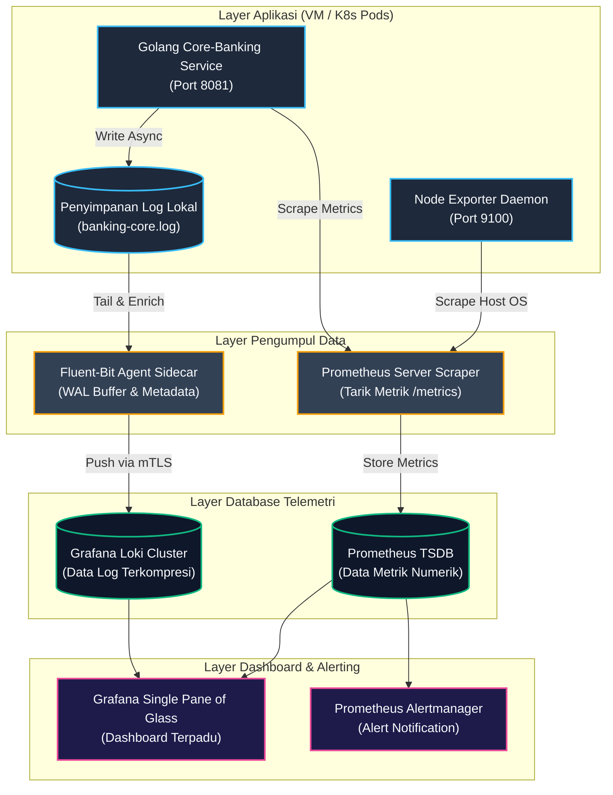
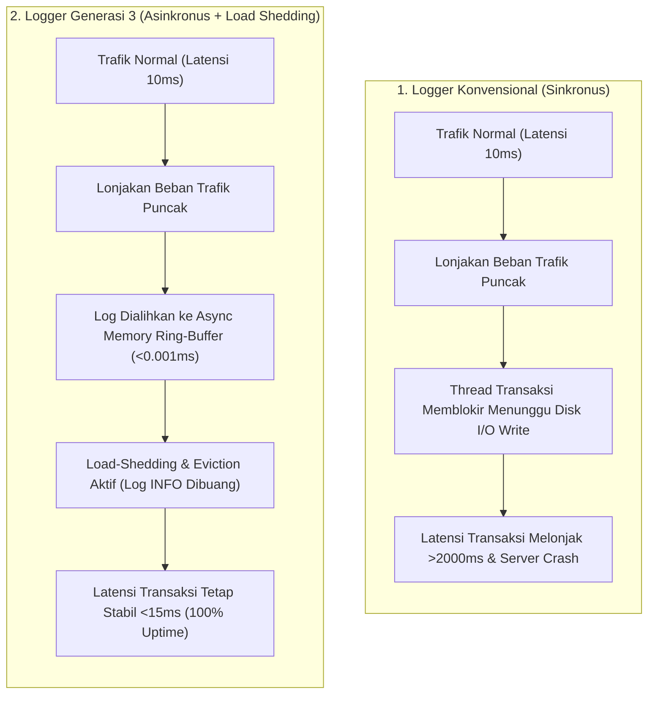
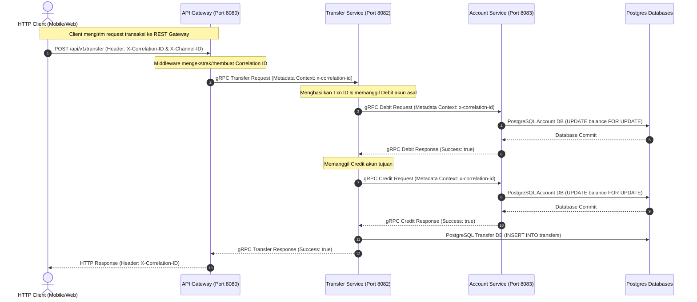
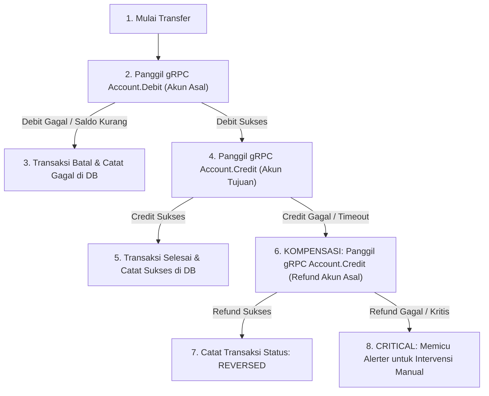

# PANDUAN & DOKUMENTASI TEKNIS PROOF OF CONCEPT (PoC)
## IMPLEMENTASI TELEMETRI & OBSERVABILITY GENERASI 3 UNTUK PLATFORM CORE BANKING

## 💼 1. EXECUTIVE SUMMARY (Ringkasan Eksekutif)

Panduan ini menyajikan rancangan dan hasil pengujian *Proof of Concept* (PoC) sistem pemantauan terpadu (*observability*) generasi ketiga untuk sistem transaksi perbankan berkinerja tinggi. Implementasi ini berfokus pada efisiensi biaya, kepatuhan regulasi, dan keandalan operasional.

### 1.1 Efisiensi Anggaran Penyimpanan (Cost Efficiency)
* **Dampak Bisnis:** Penghematan biaya penyimpanan data telemetri hingga **80% - 90%** secara tahunan.
* **Metode Teknis:** Implementasi penyimpanan bertingkat (*Multi-Tier Retention*). Log dikompresi sebesar 90% di tingkat aplikasi dan dipindahkan ke media penyimpanan berbiaya rendah (seperti *Private Object Storage* atau *Cold Tier Archive*) secara otomatis.

### 1.2 Kepatuhan Regulasi & Perlindungan Data (Regulatory Compliance)
* **Dampak Bisnis:** Jaminan kepatuhan terhadap standar keamanan transaksi kartu internasional (**PCI-DSS v4.0 Requirement 10**) serta regulasi perbankan domestik (**OJK POJK 11/2022** tentang Penyelenggaraan Teknologi Informasi).
* **Metode Teknis:** Penyaringan data sensitif (*PII Masking*) nomor kartu (PAN) dan CVV di dalam memori runtime sebelum ditulis ke media penyimpanan fisik.

### 1.3 Proteksi Stabilitas Layanan (Downtime Mitigation)
* **Dampak Bisnis:** Menjaga ketersediaan transaksi perbankan tetap aktif 24/7 tanpa penurunan latensi (*downtime*) pada saat lonjakan beban transaksi ekstrim (*payday traffic surge*).
* **Metode Teknis:** Mekanisme *Load Shedding* dan *Circular Eviction* otomatis yang membuang log non-kritis (`INFO`/`DEBUG`) saat antrean memori kritis demi mengamankan kapasitas CPU dan RAM server utama.

### 1.4 Peningkatan Kecepatan Pemecahan Masalah (Improved MTTR)
* **Dampak Bisnis:** Peningkatan kecepatan tim operasional dalam mendeteksi dan menyelesaikan anomali transaksi menjadi **`< 5 detik`** sebelum berdampak pada nasabah.
* **Metode Teknis:** Integrasi korelasi satu pintu (*Single Pane of Glass*) antara metrik (Prometheus) dan log terstruktur (Grafana Loki).

---

## 🛠️ 2. DOKUMENTASI SISTEM & SPESIFIKASI TEKNIS (PoC Scope)

Sistem PoC diimplementasikan menggunakan arsitektur modular yang terdekopel (*decoupled*) untuk menjamin fleksibilitas deployment baik di lingkungan kontainer maupun bare-metal VM.

### 2.1 Diagram Arsitektur Telemetri Terintegrasi

Berikut adalah aliran data telemetri (Logs, Metrics, Traces) dari tingkat aplikasi hingga visualisasi di dashboard pusat:



### 2.2 Struktur Komponen Repositori
1. **`bank-core-service`**: Microservice transaksi keuangan perbankan core berbasis Golang yang dilengkapi orkestrasi kontainer.
2. **`banking-baremetal-native`**: Implementasi native yang berjalan langsung di sistem operasi host untuk mensimulasikan lingkungan Virtual Machine (VM).
3. **`enterprise-logging-platform`**: Konfigurasi agen pengumpul log (*log shipper*) Fluent-bit yang dilengkapi Write-Ahead Log (WAL) lokal.
4. **`enterprise-monitoring-platform`**: Konfigurasi database telemetri terpusat (Grafana Loki dan Prometheus) beserta dashboard visualisasi.

### 2.3 Fitur Teknis Utama yang Diterapkan
* **Asynchronous Memory Ring-Buffer:** Memindahkan beban I/O disk dari thread utama aplikasi ke thread latar belakang menggunakan Go channel berkapasitas dinamis.
* **Contextual Correlation ID & Channel ID:** Menyematkan ID unik pada setiap siklus hidup HTTP request untuk memudahkan pelacakan log lintas komponen.
* **Telemetry De-duplication Strategy:** Memisahkan penyimpanan data numerik agregat (Prometheus) dengan detail log audit (Loki) guna menghindari masalah *High Cardinality* pada database metrik.

### 2.4 Perbandingan Alur Keandalan & Latensi Transaksi (Downtime Mitigation Chart)

Bagan berikut membandingkan perilaku stabilitas latensi transaksi perbankan saat terjadi lonjakan beban trafik (*payday spikes*) antara arsitektur logger konvensional dengan logger generasi ketiga:



---

## 📊 3. ESTIMASI KEBUTUHAN RESOURCE (Capacity Sizing Worksheet)

Sizing resource berikut dirancang secara netral terhadap vendor cloud maupun perangkat keras on-premise:

### 3.1 Tier LOW: Lingkungan Development / Sandbox (Trafik < 50 TPS)
* **Karakteristik:** Seluruh komponen digabung dalam satu VM/Host, penyimpanan lokal (HDD), tanpa redundansi.
* **Topologi:** 1x Virtual Machine (1 Core CPU, 2 GB RAM).

| Komponen | Kebutuhan CPU | Kebutuhan RAM | Kebutuhan Storage (Disk) |
| :--- | :--- | :--- | :--- |
| **Golang App** | 0.1 Core CPU | 30 MB - 50 MB | < 1 GB |
| **Fluent-bit** | 0.05 Core CPU | 15 MB - 30 MB | < 100 MB |
| **Prometheus** | 0.2 Core CPU | 250 MB - 500 MB | 5 GB (Retensi 7 Hari) |
| **Grafana Loki** | 0.2 Core CPU | 250 MB - 500 MB | 5 GB (Retensi 7 Hari) |
| **Grafana UI** | 0.1 Core CPU | 100 MB - 200 MB | < 1 GB |
| **TOTAL TIER LOW** | **1 Core CPU** | **1.5 GB - 2 GB RAM**| **20 GB HDD** |

### 3.2 Tier MEDIUM: Lingkungan Staging / UAT (Trafik 100 - 500 TPS)
* **Karakteristik:** Komponen terbagi dalam VM/Host terpisah, penyimpanan SSD, retensi log standar 30 hari.
* **Topologi:** Cluster VM Terdedikasi (Total 4 Core CPU, 8-10 GB RAM).

| Komponen | Kebutuhan CPU | Kebutuhan RAM | Kebutuhan Storage (Disk) |
| :--- | :--- | :--- | :--- |
| **Golang App (2 Replicas)** | 1 Core CPU (Total) | 512 MB RAM (Total) | 2 GB |
| **Fluent-bit (Agent)** | 0.2 Core CPU | 64 MB RAM | 2 GB (Buffer Disk WAL) |
| **Prometheus** | 1 Core CPU | 2 GB - 4 GB RAM | 50 GB SSD (Retensi 30 Hari) |
| **Grafana Loki** | 1 Core CPU | 2 GB - 4 GB RAM | 100 GB SSD (Retensi 30 Hari) |
| **Grafana UI** | 0.5 Core CPU | 512 MB RAM | < 2 GB |
| **TOTAL TIER MEDIUM** | **4 Core CPU** | **8 GB - 10 GB RAM** | **150 GB - 200 GB SSD** |

### 3.3 Tier IDEAL: Lingkungan Production Core Banking (Trafik 1.000 - 10.000+ TPS)
* **Karakteristik:** *High Availability* (HA) aktif, Loki mode *Microservices* terdistribusi, penyimpanan Object Storage S3-API, mTLS aktif.
* **Topologi:** Cluster Kubernetes (seperti OpenShift, Tanzu, EKS) di atas minimal 3 server fisik.

| Komponen | Kebutuhan CPU | Kebutuhan RAM | Kebutuhan Storage (Disk) |
| :--- | :--- | :--- | :--- |
| **Golang App (5-20 Pods)** | 4 - 8 Core CPU | 4 GB - 8 GB RAM | Stateless (Tanpa disk lokal) |
| **Fluent-bit (per Node)** | 0.5 Core CPU / node | 128 MB RAM / node | 10 GB SSD (WAL Buffer / Node) |
| **Prometheus (HA/Thanos)** | 8 - 16 Core CPU | 16 GB - 32 GB RAM | 200 GB SSD (Metadata & Hot Cache) |
| **Grafana Loki (Clustered)** | 12 - 24 Core CPU | 16 GB - 32 GB RAM | 100 GB SSD (Cache) + Object Storage (MinIO / Ceph / Cloud Bucket) |
| **Grafana UI (2 Replicas)** | 2 Core CPU | 2 GB RAM | < 5 GB |
| **TOTAL TIER IDEAL** | **32 - 48 Core CPU** | **64 GB - 128 GB RAM**| **500 GB SSD + Terabytes Object Storage** |

### 3.4 Spesifikasi Perangkat Keras Fisik (On-Premise Procurement)
Spesifikasi minimal per server node (Direkomendasikan minimal 3-6 unit server tipe Dell PowerEdge atau HPE ProLiant):
* **Processor:** Dual-socket Intel Xeon Gold atau AMD EPYC (Minimal 64 Cores / 128 Threads per Server).
* **Memory (RAM):** Minimal 256 GB s/d 512 GB DDR5 ECC Registered RAM per Server.
* **Storage:** 2x SSD (RAID-1 untuk Boot OS) + 2x NVMe SSD (Local Cache/WAL Buffer) + Koneksi ke SAN/NAS Storage Array via Fiber Channel/Ethernet 10Gbps+.

---

## 🧹 4. KEBIJAKAN RETENSI & HOUSEKEEPING LOG (Retention Management)

Siklus penyimpanan data log dirancang untuk menyeimbangkan efisiensi biaya dan kepatuhan hukum:

### 4.1 Skema Penyimpanan Bertingkat (Siklus Hidup Data)
1. **Tier 1: Hot Disk (SSD Lokal Server):**
   * **Retensi:** 1 s/d 7 Hari.
   * **Kebijakan:** Rotasi otomatis per **100 MB**. Data dikompresi langsung ke format **`.gz`**. Log lokal dihapus otomatis setelah 7 hari.
2. **Tier 2: Warm Storage (Object Storage - MinIO/Ceph/Cloud S3):**
   * **Retensi:** 30 s/d 90 Hari.
   * **Kebijakan:** Log disimpan dalam format chunks terkompresi. Data indeks disimpan di SSD Loki agar dapat dicari kapan saja via Grafana.
3. **Tier 3: Cold Storage (Tape Library / S3 Glacier):**
   * **Retensi:** 1 s/d 7 Tahun (Sesuai regulasi retensi bukti hukum OJK/BI).
   * **Kebijakan:** Data dipindahkan otomatis menggunakan aturan siklus hidup objek (*Object Lifecycle Rules*). Data dienkripsi menggunakan KMS. Kueri membutuhkan waktu pemulihan (*restore*) 3-5 jam.

---

## 🛠️ 5. OPERATIONAL RUNBOOK (SRE Incident Playbook)

Protokol penanganan insiden operasional telemetri oleh tim SRE (*Site Reliability Engineer*):

### 5.1 Penanganan Alert `LogSheddingActive`
* **Definisi:** Antrean memori buffer log terisi **> 90%**. Sistem mendrop log tingkat rendah (`INFO`/`DEBUG`) untuk mengamankan stabilitas aplikasi.
* **Prosedur Pemulihan:**
  1. Validasi metrik volume request (`http_requests_total`) pada Grafana untuk mendeteksi potensi lonjakan request wajar atau serangan siber.
  2. Tambahkan kapasitas instansi aplikasi (*Scale Out* pod/node) untuk membagi beban trafik.

### 5.2 Penanganan Alert `FluentbitOutputErrors`
* **Definisi:** Log shipper gagal mengirim data ke Loki (gangguan jaringan/Loki *down*).
* **Prosedur Pemulihan:**
  1. Periksa status database Loki (`bank-loki-server`). Lakukan restart service jika diperlukan.
  2. **Jaminan Integritas Data:** Agen Fluentbit secara otomatis menahan log di penyimpanan lokal menggunakan sistem WAL (Write-Ahead Log) hingga koneksi kembali normal.

---

## 🛡️ 6. VERIFIKASI KEPATUHAN AUDIT (Compliance Verification Playbook)

Instruksi pengujian untuk membuktikan kepatuhan sistem kepada regulator keuangan (Auditor OJK/BI):

### 6.1 Pengujian Masking Data Sensitif (PCI-DSS)
* **Metode Uji:** Kirim request transfer dana menggunakan payload kartu kredit asli:
  ```bash
  curl -s -X POST http://localhost:8081/api/v1/transfer \
    -H "Content-Type: application/json" \
    -d '{"card_pan": "4532-1102-3344-5566", "cvv": "999", "amount": 100000}'
  ```
* **Bukti Audit:** Tunjukkan bahwa file log `/logs/banking-core.log` menyamarkan data sensitif menjadi:
  `Fund transfer initiated for card 453211******5566`
  dan CVV bernilai `"***MASKED***"`.

### 6.2 Pengujian Ketersediaan Data Shutdown (Zero Log Loss)
* **Metode Uji:** Kirim sinyal penghentian paksa (`SIGTERM`) saat aplikasi sedang sibuk memproses transaksi:
  ```bash
  pkill -15 bank-service
  ```
* **Bukti Audit:** Tunjukkan baris log terakhir yang membuktikan pengurasan memori buffer berjalan sukses sebelum proses mati:
  `"message": "SIGTERM/SIGINT received: Commencing graceful shutdown of native service..."`

---

## 📘 7. PANDUAN BELAJAR & BEDAH KODE (Developer Self-Learning Deep-Dive)

Bagian ini dirancang untuk memudahkan pemahaman mandiri mengenai arsitektur kode telemetri, logika antrean memori, serta teknik kueri data pada Prometheus dan Loki.

### 7.1 Bedah Kode Logika Antrean & Load Shedding (`logger.go`)

Konsep pertahanan logger di dalam file **[`pkg/logger/logger.go`](file:///Users/hasan/Projects/banking-baremetal-native/pkg/logger/logger.go)** dibagi menjadi tiga tahap pertahanan:

#### A. Deteksi Kepadatan Antrean (`IsNearlyFull`)
```go
func (b *AsyncLogBuffer) IsNearlyFull() bool {
	if b == nil || b.channel == nil {
		return false
	}
	return len(b.channel) >= int(float64(cap(b.channel))*0.9)
}
```
* **Cara Belajar:** Fungsi `len(channel)` mengambil jumlah pesan log yang mengantre di RAM saat ini. Fungsi `cap(channel)` mengambil batas maksimum kapasitas buffer (misal 50). Jika antrean terisi **90% atau lebih**, fungsi ini mengembalikan `true`. Operasi ini sangat hemat CPU karena berjalan di level memori \(O(1)\).

#### B. Menggugurkan Log Level Rendah (Load Shedding)
```go
if asyncWriter != nil && asyncWriter.IsNearlyFull() && r.Level < slog.LevelWarn {
	return nil
}
```
* **Cara Belajar:** Logika ini dipasang pada method `Handle()` milik Custom Logger. Jika sensor `IsNearlyFull()` aktif, dan pesan log yang masuk bernilai di bawah `WARN` (yaitu log `INFO` atau `DEBUG`), logger langsung mengembalikan `nil` (membuang log tersebut sebelum sempat diolah menjadi teks JSON dan memakan memori heap).

#### C. Pembuangan Log Terlama (Circular Eviction)
```go
select {
case b.channel <- cp: // Ingest normal
	return len(p), nil
default: // Jika channel 100% penuh
	select {
	case <-b.channel: // Sedot & buang 1 log terlama di ujung depan antrean (LIFO)
	default:
	}
	select {
	case b.channel <- cp: // Masukkan log baru
	default:
	}
	return len(p), nil
}
```
* **Cara Belajar:** Menggunakan blok `select-case-default` di Go. Jika antrean memori 100% penuh (kasus `default` terpilih), kita memaksa menyedot satu data terlama keluar dari channel `<-b.channel` tanpa menyimpannya ke mana pun (dibuang). Setelah ruang kosong tercipta, log transaksi terbaru dimasukkan kembali. Ini menjamin alur penulisan log tidak akan pernah memblokir thread transaksi utama.

---

### 7.2 Bedah Kode Middleware RED Metrics (`correlation.go`)

Pencatatan metrik berkinerja tinggi dilakukan di **[`pkg/middleware/correlation.go`](file:///Users/hasan/Projects/banking-baremetal-native/pkg/middleware/correlation.go)**:

#### A. Definisi Vektor Metrik
```go
httpRequestsTotal = promauto.NewCounterVec(
	prometheus.CounterOpts{
		Name: "http_requests_total",
		Help: "Total HTTP requests processed.",
	},
	[]string{"method", "path", "status_code"}, // Label Low-Cardinality saja!
)
```
* **Cara Belajar:** `CounterVec` adalah metrik bertipe *counter* (angka yang terus bertambah naik). Label yang didaftarkan hanya `method` (GET/POST), `path` (URL path), dan `status_code` (200/500). Kita **tidak memasukkan** parameter unik seperti userID atau transactionID ke sini agar database Prometheus tidak kehabisan RAM.

#### B. Pengukuran Latensi (RED - Duration)
```go
durationSec := time.Since(start).Seconds()
httpRequestsTotal.WithLabelValues(r.Method, r.URL.Path, statusStr).Inc()
httpRequestDuration.WithLabelValues(r.Method, r.URL.Path, statusStr).Observe(durationSec)
```
* **Cara Belajar:** Kita mencatat waktu awal `start := time.Now()`, lalu setelah request selesai dilayani, kita hitung selisih detiknya menggunakan `time.Since(start).Seconds()`. Fungsi `.Observe(durationSec)` akan memasukkan durasi tersebut ke dalam wadah (*buckets*) histogram Prometheus untuk menghitung latensi transaksi P99/P95.

---

### 7.3 Contoh Kueri Latihan (PromQL & LogQL Cheat Sheet)

Gunakan daftar kueri berikut pada panel query Prometheus (port 9090) dan Grafana Loki (port 3000) untuk latihan analisis sistem:

#### A. Kueri PromQL (Untuk Metrik di Prometheus / Grafana Dashboard)

1. **Transaction Throughput (TPS - Transactions Per Second):**
   Menghitung jumlah transaksi per detik rata-rata dalam rentang waktu 5 menit terakhir:
   ```promql
   sum(rate(http_requests_total{path="/api/v1/transfer"}[5m]))
   ```
2. **Uptime Persentase Kesuksesan API (Success Rate):**
   Melihat persentase transaksi sukses (`200 OK`) dibandingkan seluruh transaksi:
   ```promql
   sum(rate(http_requests_total{status_code="200"}[5m])) / sum(rate(http_requests_total[5m])) * 100
   ```
3. **Latensi Transaksi Terlama P99 (99th Percentile Latency):**
   Mencari waktu tunggu terlama yang dialami oleh 1% nasabah (target bank biasanya di bawah 100ms):
   ```promql
   histogram_quantile(0.99, sum(rate(http_request_duration_seconds_bucket[5m])) by (le))
   ```

#### B. Kueri LogQL (Untuk Pencarian & Analisis Log di Grafana Loki)

1. **Mencari Seluruh Transaksi yang Mengalami Error:**
   Menyaring log yang berasal dari aplikasi perbankan kita dan mengandung kata "error":
   ```logql
   {job="baremetal-banking"} |= "ERROR"
   ```
2. **Mem-parse Data JSON & Memfilter Berdasarkan Parameter:**
   Membongkar struktur JSON log secara dinamis dan mencari transaksi transfer yang nominalnya di atas 100 juta rupiah:
   ```logql
   {job="baremetal-banking"} | json | amount > 100000000
   ```
3. **Menghitung Total Nominal Transfer yang Terjadi Hari Ini:**
   Membongkar JSON, mengambil kolom `amount`, lalu menjumlahkannya secara akumulatif:
   ```logql
   sum(sum_over_time({job="baremetal-banking"} | json | unwrap amount [24h]))
   ```

---

## ⚙️ 8. PANDUAN PEMASANGAN & BLUEPRINT KONFIGURASI (Setup & Configuration Blueprints)

Berikut adalah daftar lengkap file konfigurasi dan skrip otomatis yang digunakan untuk menjalankan infrastruktur PoC Observability secara utuh.

### 8.1 Konfigurasi Log Shipper Agent (`fluent-bit-native.conf`)
Konfigurasi agen Fluent-bit untuk menyedot file log aplikasi, menyaring data, dan mengirimkannya ke database Grafana Loki:
```ini
[SERVICE]
    Flush         1
    Log_Level     info
    Daemon        off
    Parsers_File  parsers.conf
    storage.path  /tmp/fluentbit-native-buffer
    storage.sync  normal
    HTTP_Server   On
    HTTP_Port     2020
    HTTP_Listen   0.0.0.0

[INPUT]
    Name              tail
    Tag               banking.baremetal.service
    Path              /Users/hasan/Projects/banking-baremetal-native/logs/banking-core.log
    Parser            json_banking
    Mem_Buf_Limit     5MB
    Skip_Long_Lines   On
    Refresh_Interval  1
    storage.type      filesystem

[FILTER]
    Name         modify
    Match        banking.baremetal.*
    Add          deployment_mode baremetal-native-host
    Add          datacenter_node jkt-datacenter-rack-01

[OUTPUT]
    Name          loki
    Match         banking.*
    Host          host.containers.internal
    Port          3100
    URI           /loki/api/v1/push
    Labels        job=baremetal-banking, env=production, app=native-bank-service
    Line_Format   json

[OUTPUT]
    Name         stdout
    Match        *
    Format       json_lines
```

### 8.2 Konfigurasi Prometheus Scraper Target (`prometheus.yml`)
Konfigurasi database Prometheus untuk menarik data metrik numerik dari endpoint Go API dan internal agen Fluent-bit:
```yaml
global:
  scrape_interval: 5s # Frekuensi scraping dipercepat untuk feedback simulasi cepat
  evaluation_interval: 5s

scrape_configs:
  # 1. Menarik metrik dari Aplikasi Golang API
  - job_name: 'baremetal-banking-service'
    metrics_path: '/metrics'
    static_configs:
      - targets: ['host.containers.internal:8081']

  # 2. Menarik metrik internal dari Agen Fluent-bit
  - job_name: 'fluent-bit-shipper'
    metrics_path: '/api/v1/metrics/prometheus'
    static_configs:
      - targets: ['host.containers.internal:2020']
```

### 8.3 Skrip Orkestrasi Otomatisasi PoC (`run_monitoring_native.sh`)
Skrip Bash untuk menyalakan daemon aplikasi Golang di latar belakang host host, serta menyalakan agen pengumpul log kontainer Fluent-bit:
```bash
#!/bin/bash
set -e

PROJECT_DIR="/Users/hasan/Projects/banking-baremetal-native"
cd "$PROJECT_DIR"
mkdir -p logs

# 1. Bersihkan instansi proses lama untuk menghindari bentrokan port
pkill -f "bank-service" || true
podman rm -f bank-fluent-bit-shipper 2>/dev/null || true

# 2. Nyalakan Layanan Native Golang di Latar Belakang (Port 8081)
echo "🚀 Memulai Aplikasi Native Golang di http://localhost:8081..."
nohup ./bin/bank-service > "$PROJECT_DIR/logs/stdout.log" 2>&1 &
SERVER_PID=$!
sleep 1.5

# 3. Jalankan Kontainer Agent Fluent-bit
echo "📡 Memulai Agent Fluent-bit Container (Port Metrik 2020)..."
podman run -d --name bank-fluent-bit-shipper \
  -p 2020:2020 \
  --add-host host.containers.internal:host-gateway \
  -v "$PROJECT_DIR/config/fluent-bit-native.conf:/fluent-bit/etc/fluent-bit.conf:ro" \
  -v "$PROJECT_DIR/config/parsers.conf:/fluent-bit/etc/parsers.conf:ro" \
  -v "$PROJECT_DIR/logs:/Users/hasan/Projects/banking-baremetal-native/logs:ro" \
  cr.fluentbit.io/fluent/fluent-bit:3.1.4 > /dev/null

sleep 2

# 4. Kirim 5 Transaksi Simulasi Awal untuk Mengisi Data Telemetri
echo "💸 Mengirimkan 5 transaksi simulasi..."
for i in {1..5}; do
  curl -s -X POST http://localhost:8081/api/v1/transfer \
    -H "Content-Type: application/json" \
    -H "X-Correlation-ID: txn-bm-metric-00$i" \
    -H "X-Channel-ID: ATM_METRICS" \
    -d "{\"source_account\":\"110-000-$i\",\"target_account\":\"889-000-$i\",\"amount\":5000000,\"currency\":\"IDR\",\"card_pan\":\"4532-1102-0000-000$i\",\"cvv\":\"123\"}" > /dev/null
done
echo "✅ Transaksi simulasi sukses terkirim!"
```

---

## 🏗️ 9. ARSITEKTUR MIKROSERVIS & DISTRIBUTED LOG CORRELATION PoC (Phase 3-6)

Sebagai bentuk peningkatan arsitektur untuk sistem core banking terdistribusi yang terdekopel, sistem dikembangkan menjadi arsitektur mikroservis berbasis gRPC dengan mekanisme korelasi log tanpa OpenTelemetry (OTel).

### 9.1 Aliran Transaksi & Korelasi Log (Distributed Log Correlation Flow)

Mekanisme korelasi log diimplementasikan dengan meneruskan parameter `X-Correlation-ID` dan `X-Channel-ID` melalui context header HTTP di sisi luar, lalu diteruskan via gRPC Metadata Context di sisi dalam:



### 9.2 Saga Compensating Transaction (Pola Kompensasi Transaksi)

Karena arsitektur database mengadopsi prinsip *Database-per-Service* (database `account_db` dan `transfer_db` terpisah secara fisik), transaksi global ACID tidak dapat dilakukan secara langsung. Sebagai gantinya, **Transfer Service** mengimplementasikan pola **Saga Compensating Transaction (Refund Pattern)**:



### 9.3 Interseptor & Client Metadata untuk Propagasi Korelasi ID

#### A. Sisi Penerima (gRPC Unary Interceptor Downstream)
Membaca parameter Correlation ID dari metadata context gRPC dan menyuntikkannya ke context internal aplikasi agar terdeteksi oleh custom logger:
```go
func correlationInterceptor(ctx context.Context, req interface{}, info *grpc.UnaryServerInfo, handler grpc.UnaryHandler) (interface{}, error) {
	md, ok := metadata.FromIncomingContext(ctx)
	var correlationID string
	var channelID string
	if ok {
		if ids := md.Get("x-correlation-id"); len(ids) > 0 {
			correlationID = ids[0]
		}
		if ids := md.Get("x-channel-id"); len(ids) > 0 {
			channelID = ids[0]
		}
	}
	if correlationID != "" {
		ctx = context.WithValue(ctx, logger.CorrelationIDKey, correlationID)
	}
	if channelID != "" {
		ctx = context.WithValue(ctx, logger.ChannelIDKey, channelID)
	}
	return handler(ctx, req)
}
```

#### B. Sisi Pengirim (Forwarding via gRPC Outgoing Metadata Context)
Sebelum memanggil API gRPC downstream, Transfer Service menyuntikkan ID ke dalam metadata context outgoing:
```go
correlationID, _ := ctx.Value(logger.CorrelationIDKey).(string)
channelID, _ := ctx.Value(logger.ChannelIDKey).(string)

// Menyisipkan ID korelasi ke metadata outgoing
md := metadata.Pairs("x-correlation-id", correlationID, "x-channel-id", channelID)
outCtx := metadata.NewOutgoingContext(ctx, md)

// Memanggil gRPC Downstream dengan context metadata yang baru
debitRes, err := s.acctClient.Debit(outCtx, &pb.DebitRequest{...})
```

### 9.4 Cara Uji Coba E2E Transaksi & Loki Log Checking

1. **Jalankan Stack Mikroservis & Telemetri:**
   Masuk ke folder deploy dan jalankan recreate stack container:
   ```bash
   cd /Users/hasan/Projects/banking-microservices/deploy
   podman-compose down && podman-compose up -d --build
   ```
2. **Kirim REST Request Transfer Sukses (1.000.000 IDR):**
   ```bash
   curl -s -X POST http://localhost:8080/api/v1/transfer \
     -H "Content-Type: application/json" \
     -H "X-Channel-ID: MOBILE_APP" \
     -d '{"source_account":"110-000-1","target_account":"110-000-2","amount":1000000,"currency":"IDR"}'
   ```
   *Output Response:*
   `{"transaction_id":"txn-tf-1786763630-1229","success":true,"message":"transfer successful"}`

3. **Cari Seluruh Flow Log Transaksi Berdasarkan trace_id di Grafana Loki:**
   Gunakan LogQL di Grafana Explore (atau Loki UI) dengan ID Korelasi yang dikembalikan di header response (`X-Correlation-ID`):
   ```logql
   {job="banking-core"} |= "txn-gw-1786763630-4703"
   ```
   *Hasil Pencarian Loki:* Loki akan menampilkan runutan log dari API Gateway ➔ Transfer Service ➔ Account Service (Debit & Credit) secara berurutan dan teratur dalam hitungan milidetik.


